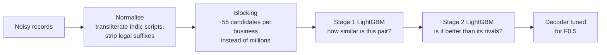

# Business Entity Resolution at Scale — Amazon ML Challenge 2026

**Team ML chads:** Aditya Ajeeth (Team Leader), Pratham Rampurmath, Adithya Sundar, Aayushman Singh

Given 1.7M reference businesses and ~10M noisy listings of them from two other sources, find every listing that
refers to the same business. Listings contain typos, abbreviations, legal suffixes in many spellings, Indic scripts
and empty addresses, and the test set includes a country (France) that never appears in training.

**Result: public leaderboard macro F0.5 of 0.953**, using no external data, APIs or pretrained models.

## Approach



1. **Normalisation** makes names and addresses comparable across spellings, scripts and abbreviations.
2. **Blocking** uses country-scoped keys (house number + street, name tokens, phonetic skeletons, rare word pairs)
   to cut trillions of possible pairs down to 94.6M candidates while keeping ~95% of true matches.
3. **Stage 1** scores each pair from 42 string-similarity features, including IDF-weighted similarity, so a
   shared rare word counts more than a shared common one.
4. **Stage 2** re-scores each pair against its competitors: how it ranks among the candidates of both records.
   Many different businesses share an address or a near-identical name, so this step matters.
5. **Decoding** assigns each listing to at most one business and keeps the number of matches that maximises
   expected F0.5.

## The key insight

Our local validation kept promising ~1.5 points more than the leaderboard delivered. The cause was the training
sample: on the real test, each listing competes with **~9.5** similar-looking businesses, but a random sample
keeps only **~2**. The model had never learned to reject that much competition. Rebuilding the sample to include
every real competitor (as context, not as labels) made local scores predict the leaderboard, and gave the
largest single improvement of the project.

| model | main change | local F0.5 (held-out entities) | leaderboard |
|---|---|---|---|
| v6 | baseline: 36 features, learned generic address words | 0.892 | 0.901 |
| v7 | realistic candidate density in training | 0.945 | 0.93 |
| v8 | sharper blocking keys, early stopping | 0.953 | 0.94 |
| v9 | expected-F0.5 decoder | 0.955 | 0.945 |
| v10 | training sample with every real competitor | 0.962 | 0.950 |
| **v11** | IDF / density features, extra word-pair candidates | **0.964** | **0.953** |

From v8 on, all choices (early stopping, thresholds, decoder) were made on one half of the held-out validation
entities, and the other half, never used for any choice, gives the score above. The validation sample itself was
improved along the way (from v9, the sample with every real competitor), which is why v9 onwards track the
leaderboard closely.

## Quick start

```bash
cd code/business_entity_resolution
pip install -r requirements.txt
python -m unittest discover -s tests      # 20 unit tests, no dataset needed
```

The exact commands that reproduce the submission from the raw data (build sample → train → predict → validate) are
in [`code/business_entity_resolution/README.md`](code/business_entity_resolution/README.md).

## Repository

| path | contents |
|---|---|
| [`code/business_entity_resolution/`](code/business_entity_resolution/) | the pipeline (`src/`), unit tests, pinned `requirements.txt`, reproduction guide |
| [`code/business_entity_resolution/ARCHITECTURE.md`](code/business_entity_resolution/ARCHITECTURE.md) | how the pipeline works and why |
| [`ML_chads_Documentation.md`](ML_chads_Documentation.md) | methodology write-up submitted to the challenge |
| `problem_statement.md`, `6ab5628d5a817_amazon_ml_challenge_problem_statement.pdf` | the challenge description (from the organisers) |
| `utils/validate_submission.py` | the organisers' submission validator |

Development notes and superseded models are kept in the git history under the tag `archive-snapshot`.
