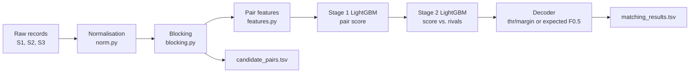

# Business Entity Resolution — Architecture

This document explains how the pipeline works and why it is built this way. `README.md` in this folder has the
exact commands to reproduce the submission; `../../ML_chads_Documentation.md` is the methodology write-up.

## 1. Problem

Each country has three sources of business records. Source 1 (S1) holds clean reference entities; Sources 2 and 3
(S2/S3) hold noisy listings of the same businesses: typos, abbreviations, missing fields, legal suffixes spelled in
many ways, and Indic scripts for India. For every S1 entity the task is to list every S2/S3 record of the same
business. The metric is **macro F0.5 per S1 entity** (precision weighted over recall); an empty prediction for an S1
entity with no true match scores a perfect 1.0.

| file | rows |
|---|---|
| train S1 / S2 / S3 | 2,206,821 / 5,034,616 / 5,285,603 |
| test S1 / S2 / S3 | 1,732,544 / 4,887,273 / 5,082,316 |

Training covers **India and the US**; the test set adds **France**, which never appears in training. No external
data, APIs or pretrained models are used: everything is learned from the provided training data.

## 2. Pipeline

### 2.1 Normalisation (`norm.py`)

- **Names:** accent stripping, punctuation removal, abbreviation expansion, and removal of legal suffixes in
  English, Indian and French/international forms (`pvt`, `llc`, `sarl`, `gmbh`, ...). The remaining **core tokens**
  carry the identity of the business.
- **Addresses:** abbreviation expansion (`rd` → `road`, `r` → `rue`), US state names to codes, leading zeros removed,
  spelled-out ordinals to digits (`thirteenth` → `13th`).
- **Indic scripts:** transliterated to Latin using only Unicode character names (`unicodedata.name`), with no
  transliteration library or lookup table. Covers Devanagari, Bengali, Gurmukhi, Gujarati, Oriya, Tamil, Telugu,
  Kannada and Malayalam.
- **Phonetic skeleton** (`skel`): drops vowels and collapses doubled consonants, so `technologies` and
  `teknolojies`, or transliterated and native spellings, get the same key.
- **Generic address words** are learned per country from the data (words in more than 1% of that country's S1
  addresses: street types, city names, `rue`, `de`, ...), so they are skipped when building keys, for any country.

### 2.2 Blocking (`blocking.py`)

Comparing every S1 record with every S2/S3 record is impossible (trillions of pairs), so blocking proposes
candidates: two records become a candidate pair only if they share a **blocking key**. Every key contains the
country, so records are only ever compared within a country.

| key | built from | catches |
|---|---|---|
| `A` | house number + next non-generic street word | same address, different name spelling |
| `N`, `P`, `Q` | sorted core name; name prefix/suffix; compact name | same name, messy address |
| `V`, `K` | phonetic skeleton of the name | spelling variants, transliteration |
| `T`, `U`, `R`, `S` | long rare name / address tokens | partial overlap |
| `X` | name key × address token | makes generic names sharp |
| `B`, `Y`, `C` | address bigram with a number; house number × rare word; compact / initials name | typo'd, reordered or website-style records (`allshivsystemscom`) |
| `M`, `L` (extra) | pairs of the 3 longest name words; pairs of the 4 longest rare address words | records with an empty address or one extra/missing word |

Key groups larger than a cap (60 S2/S3 records or 200 S1 records) are dropped as too generic. Each candidate pair
gets a weight (the sum of the reliabilities of the keys it shares), and each S1 keeps its **top 60** candidates.
The extra `M`/`L` keys are kept in separate arrays: the normal candidates are unchanged and at most 5 new pairs per S1
are added.

The key design came from diagnosing every missed true pair on training data (no shared key, only oversized keys, or
cut by the top-K). Raising the caps or top-K barely helped (India +0.6 pt recall for 2.3x candidates), so sharper
keys were added instead. On the full test set this produces **94.6M candidate pairs (~55 per S1)**, with blocking
recall of about 0.95–0.96 measured on labelled data.

### 2.3 Pair features (`features.py`)

36 features per pair (42 with `--feat-v3`), computed with rapidfuzz and plain Python, parallelised across processes:

- **Name:** ratio / token-sort / token-set / partial ratio, Jaro-Winkler and Levenshtein on core names, core-token
  Jaccard and equality, first-token equality, containment, length differences, phonetic-skeleton similarity.
- **Address:** the same string similarities, token and number-token Jaccard, first-number equality, shared blocking
  keys, empty-address flags, and **house-number edit distance and numeric gap** (a typo like 1400 → 1402 versus a
  different building like 46 → 53).
- **With `--feat-v3`:** digit-span Jaccard, exact skeleton equality, and **IDF-weighted name and address
  similarity**, where word rarity is counted over the country's full S1 file so a shared rare word counts more
  than a shared common one.

Per-record parts (normalised strings, skeletons, digit checks) are cached, which made blocking ~30% and feature
building ~25% faster with bit-identical output.

### 2.4 Two-stage model (`model.py`)

- **Stage 1** (LightGBM, up to 2000 trees, 63 leaves) scores each pair from its own features.
- **Stage 2** (LightGBM, up to 800 trees, 31 leaves) re-scores each pair from the **competition around it**: its rank
  and gap among its S1's candidates, its rank and gap among the S1 options of its S2/S3 record, the strongest rival
  score and the sum of rival scores, plus 11 raw features. With `--feat-v3` it also sees how many S1 businesses share
  the record's exact address or name skeleton (sibling density).

Stage-1 scores used to train stage 2 are out-of-fold, so stage 2 never learns from stage 1's own training
predictions. Eight model families were compared through the same pipeline (`experiments/model_bench.py`); LightGBM
was the best.

### 2.5 Decoding

Each S2/S3 record is assigned to **at most one** S1 (its best-scoring candidate). Two decoders exist:

- **Threshold/margin:** keep the pair if its score ≥ `thr` and it beats the runner-up by ≥ `margin`.
- **Expected-F0.5:** isotonic calibration of the stage-2 scores, then for each S1 keep the number of matches
  (zero allowed) that maximises the expected F0.5. It is saved as `decoder.json` and used only if it beats
  threshold/margin on the tuning half of validation. The final model uses it.

## 3. Training data and validation

### 3.1 The training sample must look like the test

The full training set does not fit in 16 GB of RAM for training, so models are trained on a sample, and how that
sample is drawn turned out to matter more than any feature:

| sample | how it is built | problem |
|---|---|---|
| name-hash sample | keep S1 by a hash of the name | look-alike businesses ~20x rarer than in reality; local 0.973 vs leaderboard 0.901 |
| entity sample (`experiments/make_sample_v2_fixed.py`) | keep 5% of S1 by id, with all their real candidates | each S2/S3 record competes with ~2 S1 businesses instead of ~9.5; local scores over-promised by ~1.5 pt |
| **rival sample** (`src/make_sample_v3.py`, final) | the entity sample **plus every rival S1** that is a real candidate of a kept S2/S3 record, and the real full-density candidate pairs | matches the test's competition; local scores track the leaderboard |

On the real test, each S2/S3 record is a blocking candidate of ~9.5 S1 businesses (71% have 5 or more). Rival S1
records are **context rows**: they are scored by stage 1 exactly like test rows and used only as competition for
stage 2 and the decoder, never as labelled examples. `shrink_sample_v3.py` reduces the sample to 2.5% of S1
(~41M pairs) so training fits in memory; it produces exactly what a smaller sampling fraction would.

### 3.2 Honest validation

Validation S1 entities are held out by hash, so no pair of a validation entity is ever trained on. They are split
again into an **ES half**, used for early stopping, threshold/margin and decoder choice, and a **REP half that is
never used for any choice**. The REP score (printed as `CLEAN`) is the honest estimate reported everywhere.

## 4. Results

| model | main change | local F0.5 (held-out entities) | public leaderboard |
|---|---|---|---|
| v6 | 36 features, learned generic address words | 0.892 (entity sample) | 0.901 |
| v7 | trained on the entity sample | 0.945 | 0.93 |
| v8 | sharper blocking keys, early stopping | 0.953 | 0.94 |
| v9 | expected-F0.5 decoder | 0.955 (rival sample) | 0.945 |
| v10 | trained on the rival sample | 0.962 | 0.950 |
| **v11** | IDF and density features, extra word-pair candidates | **0.964** | **0.953** |

v6–v8 are scored on the entity sample (v8 on its never-tuned REP half); v9–v11 on the REP half of the rival sample.

The final submission (v11) matched 5.66M pairs across 1.73M S1 entities; France, unseen in training, behaved like
India and the US. India remains the harder country (transliteration noise, empty addresses).

**Tried and not adopted:** per-country thresholds (+0.0002, noise); a separate threshold for empty addresses
(+0.0001); larger block caps or top-K (tiny recall gain for 2x candidates); learned legal suffixes (they picked up
real words such as "technologies").

## 5. Design rules

- **Country is never a model feature.** It only scopes the blocking keys, which is why the model works on France
  with no French training data.
- **Everything the model needs is saved with it.** `config.json` stores the blocking configuration and feature
  flags, so `predict.py` and `eval_full.py` rebuild exactly what the model was trained with. A model and its
  feature set are tied together: changing `features.py` requires retraining.
- **New behaviour sits behind flags that default to off**, so older models reproduce exactly. Speed-ups were only
  accepted after verifying bit-identical outputs.
- **Choices are made on the ES half only;** the REP half is reported, never tuned on.

## 6. Code map

| file | role |
|---|---|
| `src/norm.py` | normalisation, transliteration, phonetic skeleton, learned generic words |
| `src/blocking.py` | blocking keys and candidate generation |
| `src/features.py` | pair features |
| `src/model.py` | stage 1, stage 2 and both decoders |
| `src/pipeline.py` | per-country glue: load, normalise, block (or read recorded pairs), IDF and density |
| `src/evaluate.py` | the competition metric |
| `src/io_utils.py` | TSV reading and writing |
| `src/make_sample_v3.py`, `src/shrink_sample_v3.py` | the rival training sample |
| `src/train.py` | trains both stages and chooses thresholds / decoder on the ES half |
| `src/predict.py` | writes `matching_results.tsv` and `candidate_pairs.tsv` for the test set |
| `src/eval_full.py` | scores a model on labelled data with a loss breakdown |
| `tests/test_pipeline.py` | 20 fast unit tests (no dataset needed) |
| `experiments/` | one-off analyses behind the decisions above; not needed to reproduce |

Development notes and superseded models are not on `main`; they remain in the git history under the tag
`archive-snapshot`.
